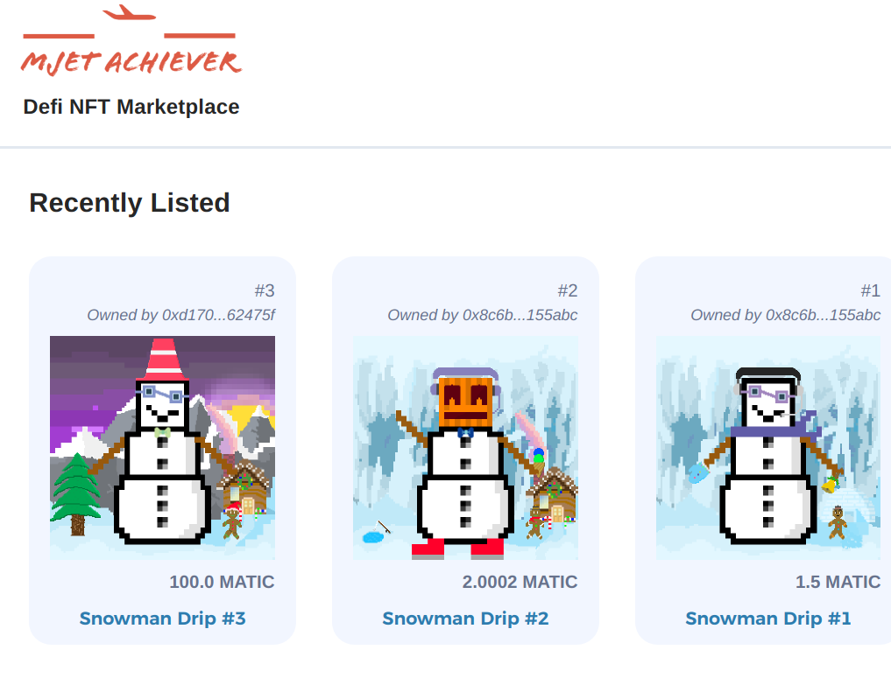

# Mumbai Etherscan addresses:

BasicNFT: 0x3aFb55E5906cE73b42A7AF19F56b1dca65f80D94
<br />
NftMarketplace: 0x17534e4c87e38bf27398C683a6584AefF85A1C32

# Hardhat NFT Marketplace 

<br/>
<p align="center">

</a>
</p>
<br/>

## Quickstart

```
git clone https://github.com/raymondfam/hardhat-nft-marketplace
cd hardhat-nft-marketplace
yarn
```

# Usage

Deploy:

```
yarn hardhat deploy
```

## Testing

```
yarn hardhat test
```


# Deployment to a testnet

1. Setup environment variabltes

You'll want to set your `MUMBAI_RPC_URL` and `PRIVATE_KEY` as environment variables. You can add them to a `.env` file.

- `PRIVATE_KEY`: The private key of your account (like from [metamask](https://metamask.io/)).

  - You can [learn how to export it here](https://metamask.zendesk.com/hc/en-us/articles/360015289632-How-to-Export-an-Account-Private-Key).
- `MUMBAI_RPC_URL`: This is url of the mumbai testnet node you're working with. You can get setup with one for free from [Alchemy](https://alchemy.com/)

2. Get MATIC

Head over to a [Mumbai Faucet](https://mumbaifaucet.com/) and get some MATIC. 

3. Deploy

```
yarn hardhat deploy --network mumbai
```